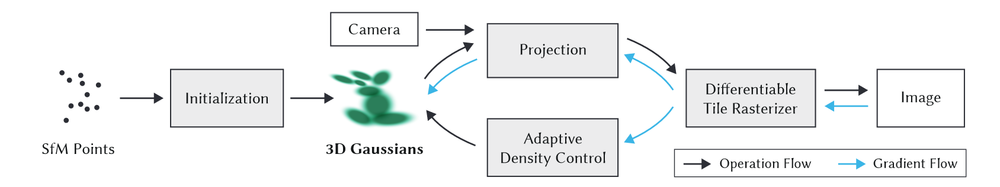
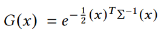
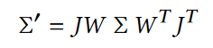
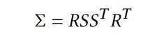
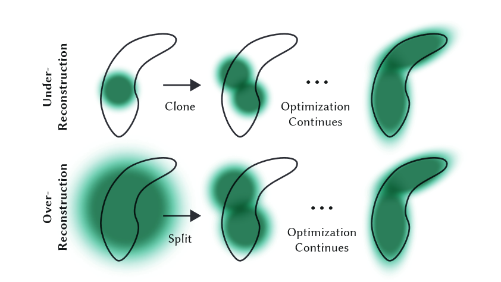

## 3D Gaussian Splatting for Real-Time Radiance Field Rendering

项目主页：[3D Gaussian Splatting for Real-Time Radiance Field Rendering (inria.fr)](https://repo-sam.inria.fr/fungraph/3d-gaussian-splatting/)

Github：[graphdeco-inria/gaussian-splatting: Original reference implementation of "3D Gaussian Splatting for Real-Time Radiance Field Rendering" (github.com)](https://github.com/graphdeco-inria/gaussian-splatting)

### 简介

​		本文提出使用 3D 高斯作为场景表示进行三维重建，实现了**SOTA的视觉质量、快速训练和实时渲染**。传统的 SfM + MVS 方法在许多情况下具有出色的表现，但是通常**无法完全从未重建区域和过度重建中恢复**；NeRF 及其变体的渲染质量更加出色，但其**训练和渲染时间非常长**。Mip-NeRF360 具有当前SOTA的图像合成质量。本文提出的方法能够达到或在某些情况下超过这种质量，同时提供快速训练和实时渲染。

### 贡献

- 引入**各向异性 3D 高斯**作为辐射场的高质量、非结构化表示，以优化空间使用和渲染效率。
- **交替进行 3D 高斯参数的优化和高斯密度自适应调整**，以创建高质量的场景表示。
- 实现**快速可微分渲染**方法，支持加速训练和实时渲染。

### 方法

​		方法的输入是一组静态场景的图像、由 SfM 校准的相应相机以及相机校准阶段产生的稀疏点云。根据这些点，我们创建了一组**由位置、协方差矩阵和不透明度 α 定义的 3D 高斯**。这会产生 3D 场景的相当紧凑的表示，部分原因是高度各向异性的体积片可用于紧凑地表示精细结构。接下来，我们交替进行 3D 高斯参数的优化和高斯密度自适应控制来建立场景的表示。方法效率的关键是**基于图块的快速光栅化器**，它允许各向异性图块的 α 混合渲染，同时使用快速排序保证可见性顺序。

​		问题：从基于图块的可微分光栅化器向高斯密度自适应梯度控制的梯度反向传播的具体机制和目的？

#### 3D 高斯泼溅

​		使用 3D 高斯作为场景表示的基元，可以轻松投影到 2D ，从而实现快速 α 混合渲染。**我们的高斯函数由世界空间中定义的完整 3D 协方差矩阵 Σ 定义 ，以点（平均值）μ 为中心**：

​		在混合渲染过程中，该高斯需要乘以透明度 α 。

​		然而，我们需要将 3D 高斯投影到 2D 进行渲染。给定观察变换 W，相机坐标中的协方差矩阵 Σ′ 如下：

​		这里 J 是射影变换的仿射近似的雅可比行列式。

​		一种明显的方法是直接优化协方差矩阵 Σ 以获得表示辐射场的 3D 高斯分布。然而，协方差矩阵仅在半正定时才具有物理意义。为了优化所有参数，我们使用梯度下降，它不能轻易地被约束来产生这样的有效矩阵，并且更新步骤和梯度可以很容易地创建无效的协方差矩阵。因此，我们选择了一种更直观、但同样具有表达能力的表示方式来进行优化。 **3D 高斯的协方差矩阵 Σ 类似于描述椭球体的配置。给定缩放矩阵S和旋转矩阵R，我们可以找到相应的Σ**：

​		为了允许对这两个因素进行独立优化，我们将它们分开存储：用于缩放的 3D 向量 s 和表示旋转的四元数 q。它们可以简单地转换为各自的矩阵并组合，同时需要确保对 q 进行归一化以获得有效的单位四元数。

​		各向异性协方差的这种表示允许我们优化 3D 高斯以适应捕获场景中不同形状的几何形状，从而产生相当紧凑的表示。

​		问题：紧凑表示的具体指的是什么？

#### 优化

​		优化基于**渲染的连续迭代并将生成的图像与捕获的数据集中的训练视图进行比较**。由于 3D 到 2D 投影的模糊性，几何图形不可避免地可能会被错误放置。因此，我们的优化需要能够创建几何体，并且如果几何体定位不正确，还需要破坏或移动几何体。 3D 高斯协方差参数的质量对于表示的紧凑性至关重要，因为可以用少量大的各向异性高斯函数捕获大的均匀区域。我们使用随机梯度下降技术进行优化，充分利用标准 GPU 加速框架以及其为某些操作添加自定义 CUDA 内核的能力。快速光栅化对于优化的效率至关重要，因为它是优化的主要计算瓶颈。

#### 自适应密度控制

​		在优化的过程中，我们应用我们的方法自适应地控制单位体积上高斯的数量及其密度，从而将初始的稀疏高斯集变为更好地表示场景的更密集的高斯集，并且具有正确的参数。优化预热后，我们每 100 次迭代进行一次致密化，并删除任何本质上透明的高斯分布，即 α 小于阈值 εα 。我们对高斯的自适应控制需要填充空白区域。它专注于缺少几何特征的区域（“**重建不足**”），但也关注高斯覆盖场景中大面积的区域（通常对应于“**过度重建**”）。

​		对于重建区域中的小高斯，我们需要覆盖必须创建的新几何形状。为此，最好通过简单地创建相同大小的副本并将其沿位置梯度的方向移动来克隆高斯。另一方面，具有高方差的区域中的大高斯需要被分割成更小的高斯。我们用两个新的高斯函数替换这些高斯函数，并将它们的尺度除以我们通过实验确定的因子 φ = 1.6。

​		与其他体积表示类似，我们的优化可能会因靠近输入摄像机的浮动体而陷入困境；在我们的例子中，这可能会导致高斯密度的不合理增加。缓和高斯数量增加的有效方法是每 N = 3000 将 α 值设置为接近于零。优化会在需要时增加高斯分布的 α，同时允许我们的剔除方法删除 α 小于 εα 的高斯分布。

​		问题：为什么会因靠近输入摄像机的浮动体而陷入困境？解决方案为何有效？

​		高斯可能会缩小或增长，并且与其他高斯有相当大的重叠，但我们会定期删除在世界空间中非常大的高斯以及在视空间中具有较大足迹的高斯。

​		问题：为什么我们要定期删除这些高斯？

#### 快速可微分光栅化

​		我们为高斯图设计了一个**基于图块的光栅化器**，通过对整个图像的基元进行预排序，避免了对每个像素进行排序的开销。

​		我们的方法首先将屏幕分割成 16×16 块，然后根据视锥体和每个块选择 3D 高斯。具体来说，我们只保留与视锥体相交的置信区间为 99% 的高斯分布。此外，我们使用保护带来简单地拒绝极端位置处的高斯分布（即那些均值接近近平面且远离视锥体的位置），因为计算它们的投影 2D 协方差将不稳定。**我们根据每个高斯重叠的图块数量来实例化它们，并为每个实例分配一个结合了视图空间深度和图块 ID 的键。然后，我们使用快速 GPU 基数排序根据这些键对高斯进行排序。**

​		对高斯进行排序后，**我们通过识别第一个和最后一个映射到给定图块的深度排序条目来为每个图块生成一个列表**。对于光栅化，我们为每个图块启动一个线程块。每个块首先协作地将高斯数据包加载到共享内存中，然后**对于给定的像素，通过从前到后遍历列表来累积颜色和 α 值**，从而最大化数据加载/共享和处理的并行性增益。当我们**达到像素中的目标饱和度 α 时，相应的线程就会停止**。每隔一段时间，就会查询图块中的线程，并且当所有像素都饱和时（即 α 变为 1），整个图块的处理就会终止。

​		在光栅化过程中，α 的饱和度是唯一的停止标准。与之前的工作相比，我们不限制接收梯度更新的混合基元的数量，以允许我们的方法处理具有任意、不同深度复杂性的场景并准确地学习它们，而不必求助于特定于场景的超参数调整。**因此，在后向传递过程中，我们必须恢复前向传递中每个像素的混合点的完整序列。**一种解决方案是将每个像素的任意长混合点列表存储在全局内存中。为了避免隐含的动态内存管理开销，**我们选择再次遍历每一个图块的列表**；我们可以重用前向传递中的高斯排序数组和平铺范围。遍历从影响图块中任何像素的最后一个点开始，再次协作地将点加载到共享内存中。

