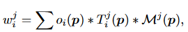

## GaussianEditor: Swift and Controllable 3D Editing with Gaussian Splatting

项目主页：[GaussianEditor (buaacyw.github.io)](https://buaacyw.github.io/gaussian-editor/)

Github： [CVPR 2024\] GaussianEditor: Swift and Controllable 3D Editing with Gaussian Splatting (github.com)](https://github.com/buaacyw/GaussianEditor)

### 简介

​		传统的 3D 编辑方法依赖于网格和点云等表示形式，通常无法真实地描绘复杂的场景。另一方面，基于隐式 3D 表示的方法（例如神经辐射场 (NeRF)）可以有效渲染复杂场景，但处理速度慢且对特定场景区域的控制有限。针对这些挑战，该论文提出了GaussianEditor ，一种基于Gaussian的创新高效的 3D 编辑算法。作者提出**高斯语义跟踪**来增强编辑的精度和控制力，跟踪在整个训练过程中跟踪编辑目标。此外，作者提出了**分层高斯分布（HGS）**，以在二维扩散模型的随机生成指导下实现稳定且精细的结果。

### 贡献

- 引入了**高斯语义追踪**，实现了更细致、更有效的编辑控制。 
- 提出了**分层高斯分布（HGS）**，这是一种新颖的 GS 表示，能够在高度随机生成指导下更稳定地收敛到精细结果。
- 设计了**高斯泼溅3D修复算法**，可以快速移除和添加对象。 

### 方法

#### 高斯语义追踪

​		3D 编辑中的先前作品通常利用静态 2D 或 3D 掩模仅在掩模像素内应用损失，从而限制编辑过程仅编辑所需区域。然而，这种方法有局限性。由于 3D 表示在训练期间动态变化，静态分割掩模将变得不准确甚至无效。**高斯语义追踪通过为每个高斯点分配语义标签，从而促进 3D 场景中的语义追踪。**具体来说，我们通过添加新属性 m 来增强 3D 高斯 $θ$，其中  $m_{ij}$ 表示第 i 个高斯点和第 j 个语义标签的语义高斯掩码。利用此属性，我们可以通过选择性地仅更新目标 3D 高斯来精确控制编辑过程。在致密化过程中，新致密化的点继承其父点的语义标签。这确保了在整个训练过程中都拥有准确的 3D 语义掩模。

​		作者通过**将 2D 分割结果的掩模反投影回 3D 的方法来获得语义高斯掩码**。对于一组 3D 高斯 θ，我们从多个视点渲染它们以生成一系列渲染图 。然后使用 2D 分割技术处理这些渲染图以获得 2D 分割掩模 M，每个 $M_j $ 代表第 j 个语义标签。为了获得每个高斯的语义标签，我们通过逆向渲染将所呈现的 2D 语义标签投影回高斯。

​		为了获得每个高斯的语义标签，我们通过逆向渲染将所呈现的 2D 语义标签投影回高斯。具体来说，我们为每个高斯维护一个权重和一个计数器。对于语义图上的像素 p，我们将语义标签反投影回影响它的高斯函数：

​		其中  $w^j_i$  表示第  $j$  个语义标签的第 $i$ 个高斯的权重，而 $o_i(p)$、$T^ j _i (p)$ 和 $M^j(p)$ 表示像素 $p$ 的不透明度、透射率和语义掩模。

​		**更新完所有高斯权重和计数器之后，我们通过检查其平均权值是否超过手动设置的阈值来确定某个高斯点是否属于某个语义类。**

​		2D 扩散引导通常难以有效地编辑复杂场景中的小对象。**得益于高斯语义追踪，我们现在可以独立渲染这些小物体并将其输入到二维扩散模型中，从而实现更精确的监督。**

#### 分层高斯分布（HGS）

​		3D GS 在重建任务中的有效性在于由 SFM 导出的点云提供的高质量初始化，以及来自 ground truth 数据集的稳定监督。在生成领域，情况发生了变化。在之前涉及 GS 的文本到 3D 和图像到 3D 的工作中，GS 由于其类似点云表示的性质，在面对生成指导的随机性时表现出了局限性。与基于神经网络的隐式表示不同，GS 的这种不稳定性主要是由于其直接暴露于损失函数的随机性。GS 模型在每个训练步骤都会更新大量高斯点，缺乏神经网络的记忆和调节能力。这就导致了更新的不稳定性，使 GS 无法达到基于神经网络的隐式表征的详细结果，因为 GS **过度的流动性阻碍了其在生成训练中的收敛性**。

​		在第 k 轮密集化过程中产生的点被标记为第 k 代。在编辑训练过程中，第 k 轮密集化产生的点被标记为第 k 代。**随后，我们对不同代数的高斯施加不同的约束，以控制它们的灵活度。代数越长，应用的约束就越强。锚损失（Anchor loss）用于强制执行这些约束。**在训练开始时，HGS 会记录所有高斯的属性作为锚点。然后更新这些锚点，以反映每次密集化过程中高斯的当前状态。在训练过程中，采用锚点状态与当前状态之间的 MSE 损失来确保高斯不会偏离各自的锚点太远：

​		$n$ 表示高斯的总数，$P$ 表示当前高斯的某种属性，包括 $x、s、q、α、c$ 集合中的元素。参数 $λ_i$ 表示应用于第 $i$ 个高斯的锚损失的强度，根据其生成情况而变化。

总体训练损失定义如下:

​		HGS 的这种分代设计避免了 GS 在面对随机损失时过于灵活的问题。**每一次增密，前几代高斯的锚损失权重 $λ_i$ 都会增加。因此，前几代高斯的流动性会逐渐降低，直至接近固化。**这种方法可以确保在随机损耗的情况下形成稳定的几何图形，依靠来自新密集化的几乎无约束的高斯来雕刻细节。此外，这种应用锚损失的方法还能有效满足各种编辑需求。同样，如果在编辑过程中不想改变颜色或几何形状，也可以对这些特定属性应用更强的锚损失。

#### **高斯泼溅3D修复算法**

​		物体移除：简单地通过掩码去除高斯函数可能会导致产生伪影，特别是在目标与其他高斯函数相交的边界处。为了解决这个问题，我们采用了2D修复技术来提供填充这些区域的指导。然而，有效的2D修补需要精确的掩码来提供更好的指导。为了生成这些掩码，在删除之后，**我们使用KNN算法来识别离被移除高斯函数最近的高斯函数，这些高斯函数可能位于接口处。**然后，这些高斯函数被投影到各种视图中。**我们随后扩张掩码并修复任何空洞，以准确地表示边界区域，从而创建边界区域的精细掩码。**

​		物体合并：我们将这个任务定义如下：在3D高斯函数 $θ$ 内，给定相机姿态 $p$ 和相应的从这个视角渲染的图像I，用户提供了一个在 $I$ 上标注了他们希望修复的区域的2D掩码 $M$ 。此外，提供了一个提示 $y$ 来指定修补的内容。然后，我们更新 $θ$ 以满足修补的请求。给定 $I$、 $M$ 和 $y$，**该过程从生成一个2D修补图像 $I^M y$ 开始，利用 2D 修补扩散模型。随后，从生成的$I^M y$中分割前景对象，并输入到图像到3D方法中以生成粗糙的3D网格。**然后，这个粗糙的网格被转换成3D高斯函数 $θy$，并在HGS中进行细化。

​		为了使 $θy$ 的坐标系与 $θ$ 的坐标系对齐，首先使估算  $I^M y$  的深度。然后使用最小二乘法将该深度与  $θ$  在相机姿态  $p$  下渲染的深度图对齐。通过这种对齐，我们可以准确地确定在 $θ$ 的坐标系中修补的前景对象的坐标和比例。将  $θy$  转换为  $θ$  的坐标系后，**我们简单地连接它们以生成最终的3D高斯函数。**

